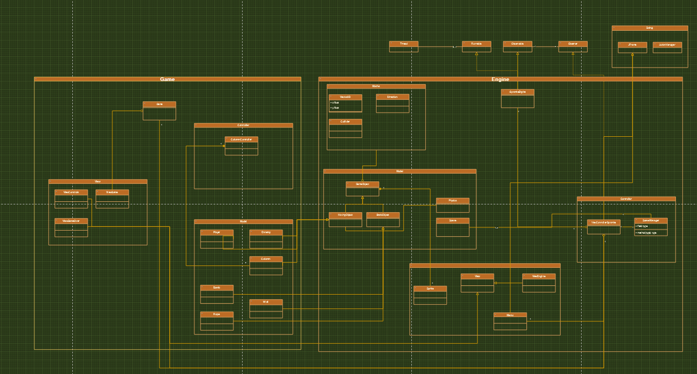
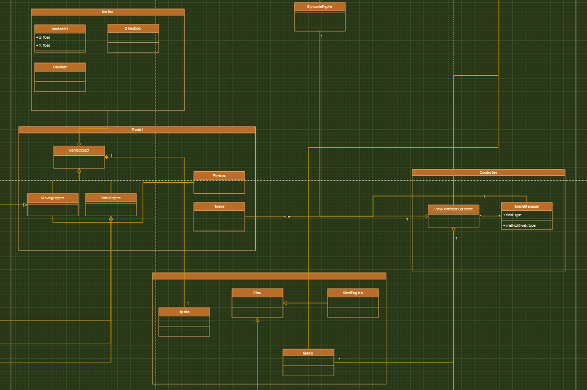
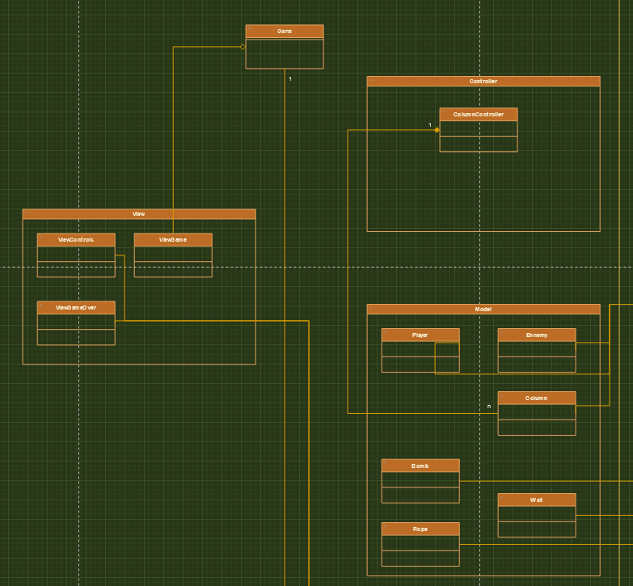
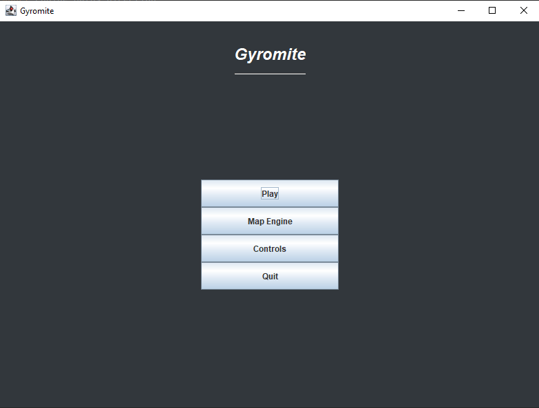
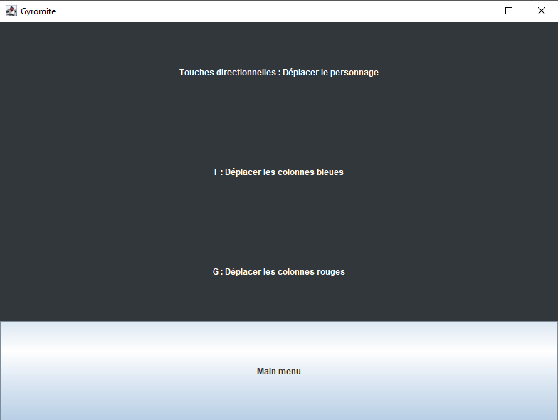
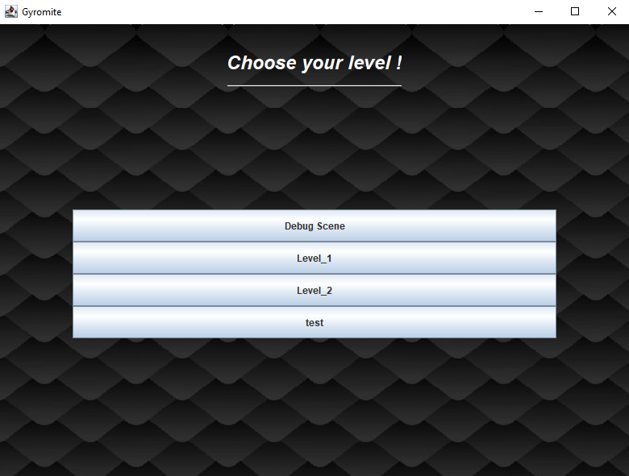
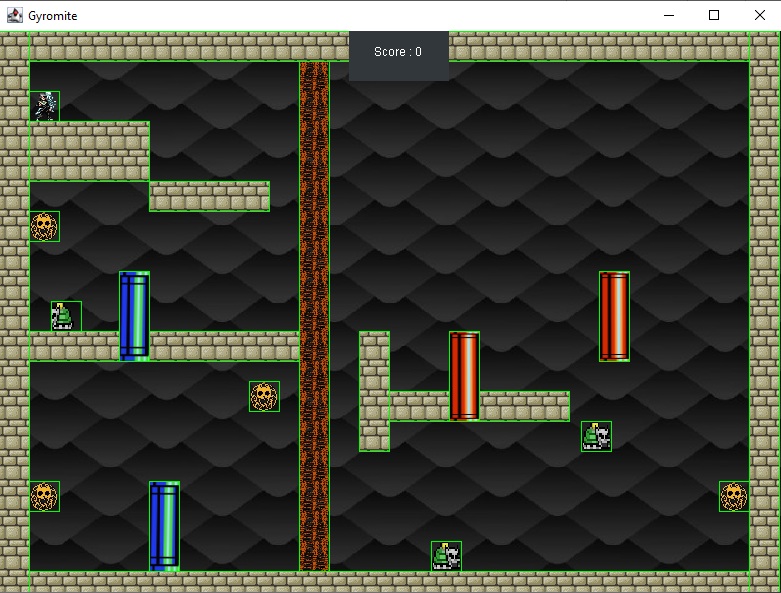
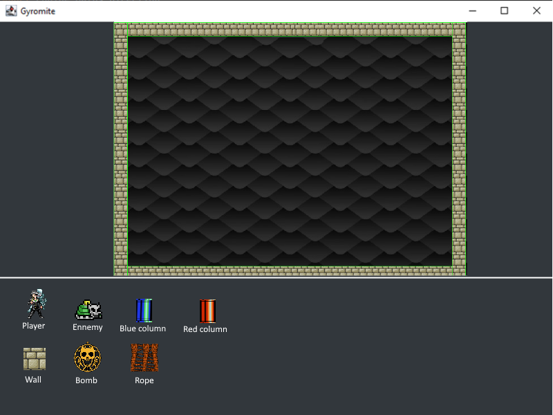
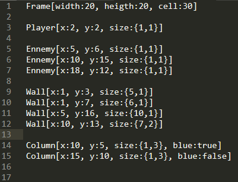

# Projet Informatique - Rapport Gyromite

|**Made by**|**Referent teacher**|
|:-:|:-:|
|OULED MOUSSA Yanis|Mr. ARMETTA Frédéric|

[Sujet](sujetGyromite-Polytech.pdf)

# Introduction
J’ai réalisé ce projet reprenant le gameplay du célèbre jeu Gyromite sorti sur NES en 1985. J’ai entièrement réalisé les fonctionnalités du jeu dans le cadre du module projet informatique.

Il est possible de retrouver le projet à l’adresse suivante : <https://github.com/Yaimuu/Gyromite>
# Choix de conception
Pour ce projet, j’ai préféré refaire la conception par moi-même, afin de pouvoir développer un jeu dans lequel les entités interagissent entre-elles dans un environnement continu ainsi que de me faciliter la tâche sur d’autres aspects du jeu, notamment la création d’entités.

Pour ce projet j’ai essayé de respecter au mieux l’architecture MVC afin d’avoir un code le plus modulaire possible.

J’utilise également un certain nombre de designs patterns tels que le design pattern Observer/Observable et quelques singletons pour diminuer les références d’objets.
## Vue d’ensemble
Voici le diagramme de classes de mon projet créé à l’aide de l’outil en ligne draw.io :

<https://app.diagrams.net/#HYaimuu%2FGyromite%2Fmain%2FConception%2FGyromite%20Class%20Diagram.drawio>

## Engine
J’ai donc choisi de créer un module « Moteur » ou « Engine » s’inspirant du moteur de jeu Unity :

## Game
Ainsi que d’un module de jeu se basant sur le moteur :

# Fonctionnalités
Pour ce projet, j’ai développé toutes les fonctionnalités de base nécessaires à la jouabilité de Gyromite :

- Gravité (le Prof. tombe si pas de sol sous ses pieds)
- Gestion des collisions (Prof. / Murs, Prof. / Smicks, Smicks / Murs, Smicks / Smicks)
- Capacité de monter/descendre aux cordes lorsque le Prof. est sur une corde
- Capacité de ramasser les objets (Bombes, Bonus)
- Capacité de faire se déplacer les Piliers + collisions Piliers (une entité écrasée par un pilier est tuée) Bonus : le Prof. doit être déplacé en même temps s’il se situe au sommet d’un Pilier
- Système de points
- Règles du jeu (mort, fin du niveau…)

J’ai également ajouté des fonctionnalités supplémentaires pour améliorer le jeu :

- Refonte de l’architecture afin de pouvoir jouer dans un environnement « continu » (qui n’est pas géré par un système de cases mais par des positions dans un repère orthonormé)
- Système de scènes permettant dé créer autant de niveaux que l’on souhaite
- Menu listant les scènes créées dans le dossier « Scenes » 
- Mode Debug permettant de voir un certain nombre d’informations supplémentaires (Visualisation des « colliders » de chaque entité, les collisions du joueur, etc…)

Cependant la fonctionnalité que je voulais créer mais que je n’ai pas eu le temps de faire est la création d’un niveau à partir de la lecture d’un fichier ainsi que la création d’un fichier en fonction d’un niveau créé dans le menu de création de niveau.

# Rendu final
Voici le jeu tel que présenté durant la soutenance.
## Menu principal
Le menu principal permet de :

- Lancer Gyromite
- Ouvrir le menu de création de niveau
- Ouvrir le menu des contrôles
- Quitter Gyromite

## Menu des contrôles
Permet de voir les contrôles du jeu.

## Sélection du niveau
Permet de sélectionner le niveau en fonction des fichiers présents dans le dossier « Scenes ».

## Jeu
Le jeu, sur cette capture d’écran le jeu est en mode débug c’est pour cela que chaque entité est encadrée en vert, il s’agit de la position du collider de l’entité.

## Création de niveaux
Je n’ai pas eu le temps de développer cette fonctionnalité donc voici l’interface j’imaginais pour cette dernière :

# Problèmes rencontrés
Durant la réalisation du projet j’ai eu l’occasion de rencontrer un certain nombre de problématiques. Pour la plupart elles étaient bénignes et faciles à résoudre mais deux m’ont principalement posé des problèmes :
## L’affichage
Concernant l’affichage du jeu, je voulais avoir un affichage classique et non un affichage case par case.

J’ai donc dans un premier temps opté pour l’utilisation d’un Canvas pour l’affichage du jeu. Cependant, l’utilisation du Canvas provoquait des clignotements d’images rendant le jeu injouable car le Canvas est un objet du package AWT et non du package SWING.

Je me suis par la suite rendu compte qu’il était possible d’utiliser les JPanel exactement de la même manière que les Canvas, ce qui m’a poussé à refaire partiellement l’architecture du projet. C’est donc après quelques jours d’essais que j’ai finalement parvenus à afficher le jeu sans problèmes.
## La génération d’un niveau à partir de la lecture d’un fichier
Le problème de la gestion de la génération d’un niveau ne s’est posé qu’à la fin pour moi, une fois que tout le reste a pu être stabilisé.

Les problèmes majeurs pour cette fonctionnalité ont été le temps qu’il me restait une fois que j’en était arrivé là et le travail à fournir pour le réalisé. De plus je voulais que l’on puisse poser n’importe quelle entité à n’importe quelle position dans l’espace de jeu. Il me fallait donc un format me permettant de faire cela. 

J’ai donc pensé à format semblable à celui-ci :

Ce format permettrait de renseigner le type d’objet ainsi que la valeur de ses propriétés, il serait donc envisageable de créer un algorithme lisant le fichier ligne par ligne et créant l’objet en question et l’ajoutant à la scène. Seul l’objet « Frame » ne serait pas créée de cette manière mais ses propriétés pourraient être modifiées en fonction du fichier.
# Conclusion
J’ai bien apprécié réaliser ce projet malgré les multiples difficultés rencontrées, notamment celles dû à l’affichage avec Swing lorsque j’ai voulu changer la structure du projet.
